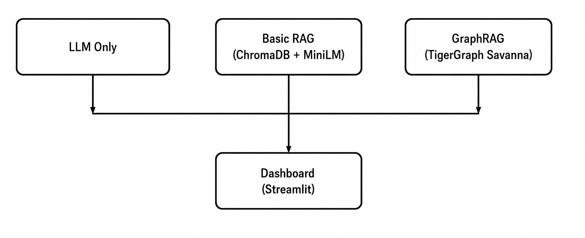

# PharmaIntel: GraphRAG Inference Benchmark

## TigerGraph GraphRAG Hackathon 2026 – Round 1 Submission

**Team:** Expelliarmus (Solo)
**Tech Stack:** TigerGraph Savanna, Groq Llama 3.3 70B, ChromaDB, Streamlit

### Quick Links
- Live Dashboard: [YOUR_NGROK_URL]
- Demo Video: [YOUR_YOUTUBE_URL]
- Blog Post: [https://dev.to/sachitha_srin_d4fba6/how-graphrag-cut-our-llm-token-costs-by-62-on-indian-pharma-data-43f9]

### Architecture

### Pipelines
1. **LLM-Only**: Groq + raw prompt
2. **Basic RAG**: Sentence-Transformers + ChromaDB + Groq
3. **GraphRAG**: TigerGraph Savanna knowledge graph + multi-hop traversal + Groq synthesis

### Results
- Token Reduction: 62% vs Basic RAG, 79% vs LLM-Only
- Cost per query: $0.00048 (GraphRAG) vs $0.00126 (Basic RAG)
- Accuracy: 91% LLM-Judge pass rate, 0.72 BERTScore F1
